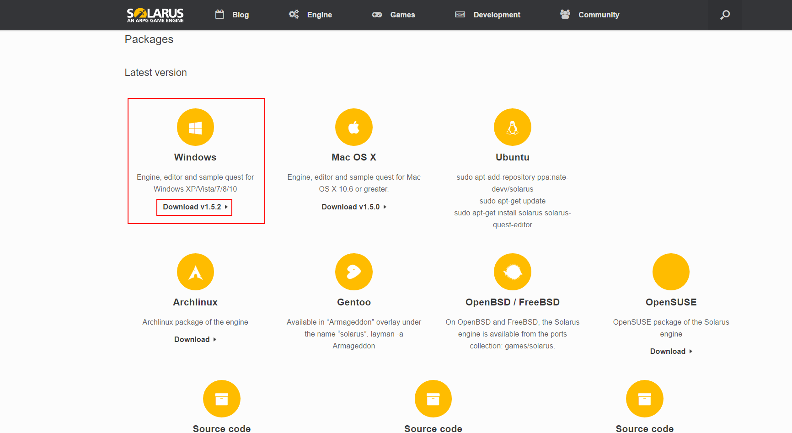
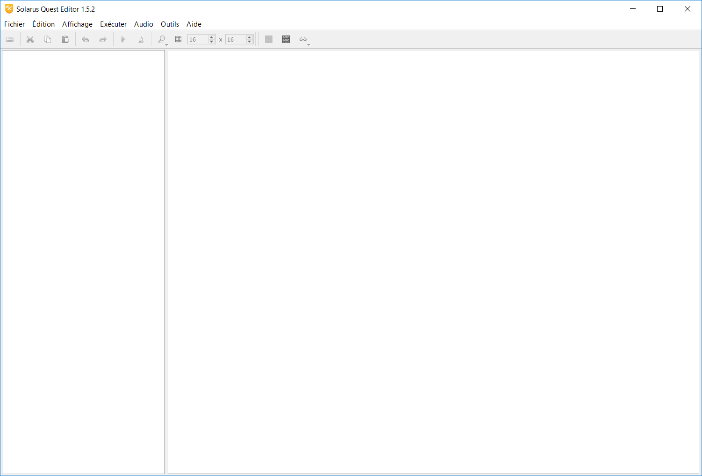

# Chapitre 1 - Installation de Solarus et création d'une quête

## 1) Installation

Pour commencer, vous allez avoir besoin (bien évidemment) du logiciel Solarus. Vous pouvez le télécharger à partir du lien ci-dessous :

[Télécharger Solarus](http://www.solarus-games.org/engine/download/)

Récupérez la version correspondant à votre système d'exploitation en cliquant sur l'icône correspondante :

Exemple pour Windows

Dans l'archive que vous aurez récupérée, vous trouverez deux dossiers : un dossier nommé "sample_quest" qui, comme son nom l'indique, contient un exemple très rapide de ce qui peut être fait avec Solarus, et un autre dossier nommé "Solarus", qui contient les fichiers pour la création et l'exécution des jeux.

Avant d'aller plus loin, voyons donc rapidement l'utilité des trois exécutables présents dans ce dossier :

- Le premier se nomme "solarus.exe". Il vous permettra de lancer toutes les quêtes créées avec l'éditeur.
- Le deuxième, nommé "solarus-quest-editor", vous permettra d'éditer les quêtes dont vous disposerez.
- Enfin, le troisième, nommé "solarus-run.exe", vous permettra de lancer la quête située dans le répertoire courant.

## 2) Création d'une quête

Avant de commencer, vous devez créer un dossier qui contiendra l'intégralité des données de votre quête. Vous pouvez le créer n'importe où, cela n'aura pas d'importance.

Lancez ensuite l'exécutable nommé "solarus-quest-editor.exe". Vous devriez voir apparaitre une fenêtre ressemblant à l'image suivante.

Vous devez maintenant créer une nouvelle quête afin de pouvoir commencer à travailler dessus. Pour cela, sélectionner "fichier", puis "nouvelle quête" en haut de la fenêtre. Sélectionnez ensuite le dossier que vous avez créé précédemment, et validez pour finaliser la création.

Une fois votre quête créée, vous devriez désormais voir une fenêtre comme celle-ci. Vous vous trouvez actuellement sur la page des propriétés de votre quête, où vous pouvez ajouter où modifier des informations relatives au jeu, comme la version actuelle ou le nom qui sera affiché sur la fenêtre. Vous pouvez aussi modifier la taille de la fenêtre de jeu ou encore spécifier le répertoire qui sera utilisé pour stocker les fichiers de sauvegarde de votre jeu.

Maintenant que notre quête est créée, nous allons pouvoir commencer les choses sérieuses. Prochaine étape : ajouter des ressources à notre projet.
